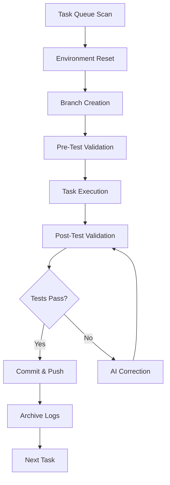

# AI Task Runner

An automated task processing system that manages and executes development tasks using AI assistance.

## Overview

This project provides a comprehensive framework for automatically processing queued development tasks with AI-powered assistance. It handles the complete lifecycle of task management including environment setup, Git operations, automated testing, and intelligent correction loops.

## Key Features

- **Automated Task Queue Processing**: Sequentially processes `.md` task files from `tasks/_queue/`
- **Intelligent Git Branching**: Creates isolated `develop/<task_name>/trunk` branches for each task
- **Robust Testing Pipeline**: Pre/post-modification testing with validation
- **AI-Powered Correction Loop**: Up to 10 automatic correction attempts with feedback
- **Clean Environment Management**: Workspace isolation and reset between tasks
- **Comprehensive Logging**: Detailed execution logs and artifact preservation
- **Multi-Runner Support**: Both Bash (`run.sh`) and Python (`task_runner.py`) interfaces

## Architecture

### Core Components

```
.
├── .tmp/                    # Task-specific temporary workspace
├── .AI_ws/                  # AI assistant workspace
├── code_under_work/         # Primary working directory (target repo)
├── prompts/                 # AI prompt configurations and templates
├── scripts/                 # Essential utility and validation scripts
├── tasks/
│   ├── _queue/              # Active task queue (drop .md files here)
│   └── _lib/                # Shared task resources
├── run.sh                   # Main Bash task processor
├── task_runner.py          # Python task processor with enhanced features
├── OcRunTask.sh            # AI task execution wrapper
├── OcRunCorrection.sh      # AI correction execution wrapper
└── reset.sh                # Environment reset utility
```

### Required Scripts

The system requires these scripts in `code_under_work/scripts/`:
- `ai_reset_env.sh` - Environment preparation and cleanup
- `ai_selfcheck.sh` - Test validation and status checking

## Quick Start

### 1. Environment Setup

```bash
# Ensure executable permissions
chmod +x *.sh
chmod +x scripts/*.sh

# Configure SSH key for Git operations
# Place your SSH key at: keys/id_rsa
```

### 2. Queue Tasks

Create task files in `tasks/_queue/`:
```bash
# Example task file
echo "Implement user authentication feature" > tasks/_queue/auth_feature.md
```

### 3. Execute Tasks

**Option A: Bash Runner (Recommended)**
```bash
./run.sh
```

**Option B: Python Runner**
```bash
python3 task_runner.py <task_name>
```

## Task Processing Workflow



### Detailed Execution Flow

1. **Validation**: Verify required scripts and environment
2. **Workspace Setup**: Clean workspace and sync `develop/trunk`
3. **Branch Isolation**: Create `develop/<task_name>/trunk` branch
4. **Baseline Testing**: Execute `ai_selfcheck.sh` to establish stability
5. **Task Processing**: Copy task file and run AI assistant via `OcRunTask.sh`
6. **Validation Testing**: Run post-modification tests
7. **Correction Loop**: If tests fail, trigger `OcRunCorrection.sh` (max 10 attempts)
8. **Git Operations**: Stage, commit, and push changes
9. **Archival**: Preserve execution logs and artifacts

## Configuration

### Environment Variables

```bash
export NO_COLOR=1                    # Disable color output for OpenRouter
export PYTHONUNBUFFERED=1            # Immediate Python output
```

### Key Settings

- **Source Branch**: `develop/trunk`
- **SSH Key Path**: `keys/id_rsa`
- **Max Correction Attempts**: 10
- **Task Queue**: `tasks/_queue/*.md`

## AI Integration

### Prompt Management

The `prompts/` directory contains:
- `INIT_AGENTS.md` - Agent initialization and guidelines
- `guide_to_write_commit_msg.md` - Commit message formatting rules
- `prompt_001.md`, `prompt_002.md` - Task-specific AI prompts

### AI Workflow

1. **Task Execution**: `OcRunTask.sh` launches AI assistant with task context
2. **Correction Processing**: `OcRunCorrection.sh` handles fix attempts
3. **Commit Messages**: AI generates standardized commit messages
4. **Environment Feedback**: Test results guide correction decisions

## Logging and Monitoring

### Execution Logs

Tasks generate comprehensive logs archived to:
```
.AI_task_log/
└── <task_name>/
    ├── .tmp/                   # Task workspace snapshot
    ├── test_before.out         # Baseline test results
    ├── test_after.out          # Post-modification test results
    ├── ai_commit_message.md    # AI-generated commit message
    └── task.md                 # Original task definition
```

### Real-time Monitoring

The runner provides detailed console output including:
- Task processing status
- Git operation results
- Test execution details
- Correction loop progress
- Environment cleanup status

## Development Workflow

### Adding New Tasks

1. Create `.md` file in `tasks/_queue/`
2. Use descriptive filename (e.g., `implement_auth.md`)
3. Include clear task requirements in file content

### Custom Scripts

Extend functionality by adding scripts to `code_under_work/scripts/`:
- `ai_reset_env.sh` - Custom environment setup
- `ai_selfcheck.sh` - Project-specific testing
- Additional utility scripts as needed

### Git Integration

The system automatically:
- Fetches all remote branches
- Creates isolated feature branches
- Commits with AI-generated messages
- Pushes to remote with force protection
- Maintains clean `develop/trunk` baseline

## Troubleshooting

### Common Issues

**SSH Authentication**
```bash
# Verify SSH key permissions
chmod 600 keys/id_rsa
```

**Script Permissions**
```bash
# Ensure all scripts are executable
find . -name "*.sh" -exec chmod +x {} \;
```

**Environment State**
```bash
# Reset workspace manually
./reset.sh
```

### Debug Mode

Enable verbose output:
```bash
# In run.sh, remove 'set -ex' or add:
export DEBUG=1
```

## Contributing

When contributing to the AI Task Runner:

1. Follow existing code conventions in Python scripts
2. Maintain Bash script compatibility (POSIX compliant)
3. Update documentation for new features
4. Test with sample tasks before submitting
5. Ensure backward compatibility with existing task queues

## License

This project is designed to integrate with various AI development workflows. Please ensure compliance with AI service terms and organizational policies when implementing in production environments.